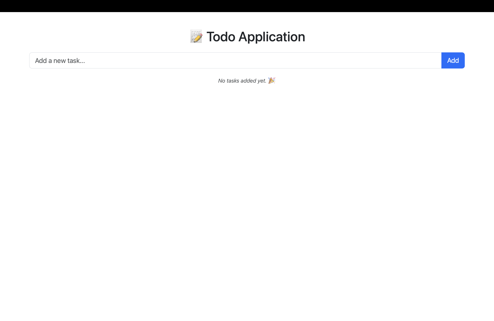
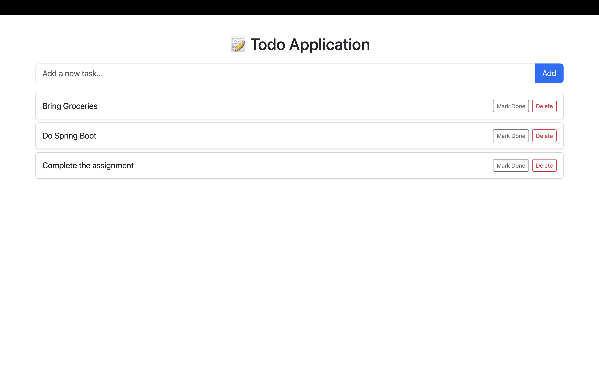

# 📝 Todo Application (Spring Boot + MySQL)

This is a simple **Todo List Web Application** built using **Spring Boot**, **Thymeleaf**, and **MySQL**.
It was created as a practice project to understand the inner workings of Spring Boot, including MVC architecture, form handling, templating, and database integration.

---

## 🚀 Features

* Add a new task
* Toggle task completion (with visual strikethrough)
* Delete a task
* Dynamic rendering using Thymeleaf
* Persistent storage with MySQL

---

## 💠 Tech Stack

| Layer        | Technology         |
| ------------ | ------------------ |
| Backend      | Spring Boot (Java) |
| View Engine  | Thymeleaf          |
| UI Styling   | Bootstrap 5        |
| Build Tool   | Maven              |
| Database     | MySQL              |
| Java Version | 17+ recommended    |

---

## 📁 Project Structure

```
.
├── pom.xml
├── mvnw / mvnw.cmd
├── project-structure.txt
├── src/
│   ├── main/
│   │   ├── java/com/example/todoapp/
│   │   │   ├── Controller/TaskController.java
│   │   │   ├── models/Task.java
│   │   │   ├── repository/TaskRepo.java
│   │   │   ├── Service/TaskService.java
│   │   │   └── TodoappApplication.java
│   │   └── resources/
│   │       ├── application.properties
│   │       ├── static/
│   │       └── templates/tasks.html
│   └── test/java/com/example/todoapp/
│       └── TodoappApplicationTests.java

```

---

## ⚙️ MySQL Configuration

Make sure you have MySQL running and update your `src/main/resources/application.properties` like this:

```properties
spring.datasource.url=jdbc:mysql://localhost:3306/todo_app
spring.datasource.username=root
spring.datasource.password=your_password

spring.jpa.hibernate.ddl-auto=update
spring.jpa.show-sql=true
spring.jpa.properties.hibernate.dialect=org.hibernate.dialect.MySQL8Dialect
spring.thymeleaf.cache=false
```

Create the database manually if it doesn't exist:

```sql
CREATE DATABASE todo_app;
```

---

## 🧪 How to Run Locally

1. **Clone the repository**

   ```bash
   git clone https://github.com/your-username/todoapp-springboot.git
   cd todoapp-springboot
   ```

2. \*\*Configure \*\*\`\` for your MySQL credentials

3. **Build and run the application**

   ```bash
   ./mvnw spring-boot:run
   ```

4. **Open in browser**

   ```
   http://localhost:8080
   ```

---

## ✍️ Learning Outcomes

This project helps you understand:

* Spring Boot project structure
* REST vs MVC controllers
* Data binding between form and model
* CRUD operations using Spring Data JPA
* Dynamic views with Thymeleaf
* Connecting to and using MySQL with Spring Boot

---

## 📌 Possible Future Enhancements

* Edit task functionality
* Mark all complete / delete all
* Add user authentication with Spring Security
* Use H2 for test profiles and MySQL for production
* Add task deadline and sort by priority

---

## 📸 Screenshots

### Empty State:



### Tasks Added:



---

## 🤝 License

MIT — for educational and personal use.
